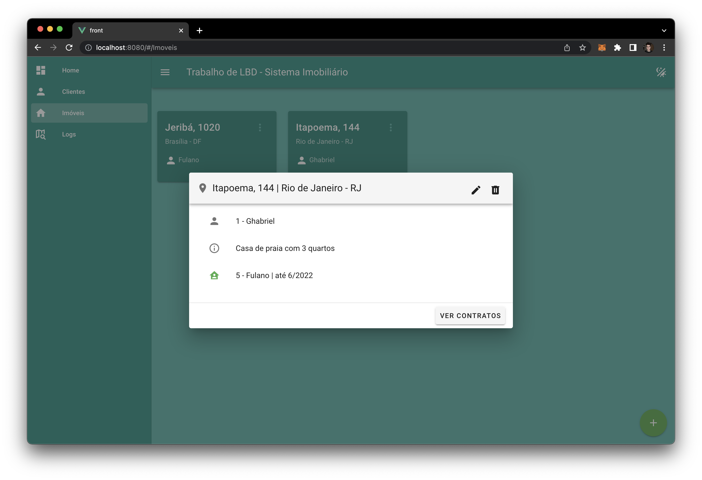
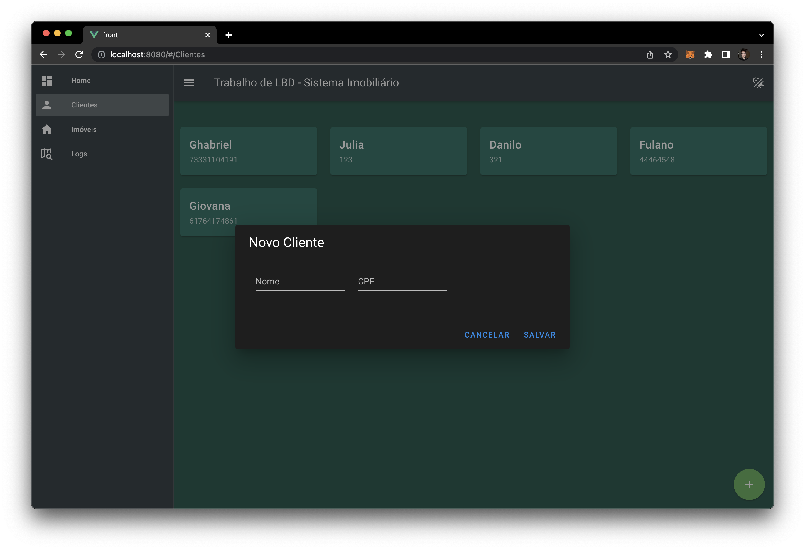

# imobiliaria-cliente

## Sobre o projeto


O objetivo deste projeto é produzir um protótipo minimamente funcional a fim
de explorar as características de um sistema para gestão imobiliária. O foco principal
do protótipo é fornecer um sistema que permita cadastro, leitura, alteração e remoção
(CRUD) de alguns dados que relacionam entre si.

#### Importante
> Este aplicativo é cliente de uma API também desenvolvida por mim, e se encontra [neste repositório](https://github.com/ghabrielmielli/imobiliaria-api).
> É necessário que a API esteja **em funcionamento** quando for executar esta aplicação.


### Feito com
✤ Vue CLI @vue/cli 4.5.13 | Projeto criado através da CLI do Vue.
- Obs: o projeto foi criado utilizando Vue 2. Atualmente o Vue já está em
sua versão 3. A escolha desta versão foi devido à biblioteca de estilização
escolhida ainda não suportar a versão 3 do framework.

✤ Dependências (exceto o padrão)
- axios | Ferramenta para facilitar requisições ao servidor
- vue-router | Roteador oficial para aplicações Vue
- vuetify | Biblioteca para estilização de componentes Vue


## Rodando o projeto

Após clonar o repositório, instale os pacotes necessários para rodar a aplicação executando o seguinte comando na pasta raiz do projeto:
```bash
npm install
```
> É provável que sejam informados alguns `WARNING!`. Não se preocupe, e *não* execute os comandos solicitados.

Depois, inicialize o projeto com o comando:
```bash
npm run serve
```

**Pronto!** O projeto estará rodando na porta 8080!

## Como utilizar a aplicação

### Cadastrando clientes e imóveis

Primeiramente, certifique-se de que a [API](https://github.com/ghabrielmielli/imobiliaria-api) está rodando.

Comece cadastrando `Clientes`, que serão alocados futuramente como `Proprietários`e `Inquilinos`.
> Faça isso pela aba de *Clientes*, que pode ser acessada através da **barra lateral** do aplicativo.

Agora que você já tem clientes cadastrados no sistema, você pode cadastrar `Imóveis` no sistema, tendo como proprietários os clientes cadastrados.

### Gerando contratos

Para criar um novo contrato, comece clicando nos "*três pontinhos*", no `card de um imóvel`.
> No pop-up com as informações, note que, caso não haja nenhum contrato ativo, um botão estará disponível para criar um novo contrato, esse botão estará indisponível, e será substituído por dados do contrato ativo caso exista.

Clicando em `ver contratos`, uma lista de contratos será exibida, e, ao final, um botão para criar um novo contrato.
> Note que não há como editar ou apagar contratos no momento. Tais funções ainda **não foram implementadas**.


## Considerações finais

Por se tratar apenas de um protótipo, as funcionalidades do aplicativo encontram-se bastante limitadas.
